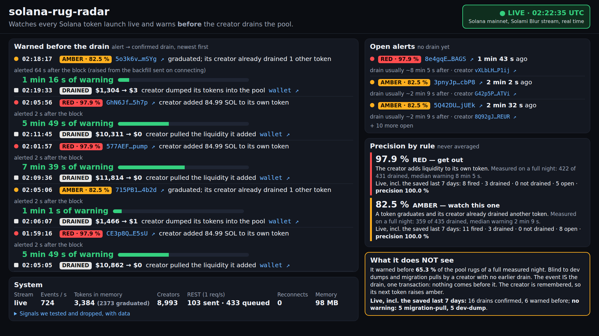
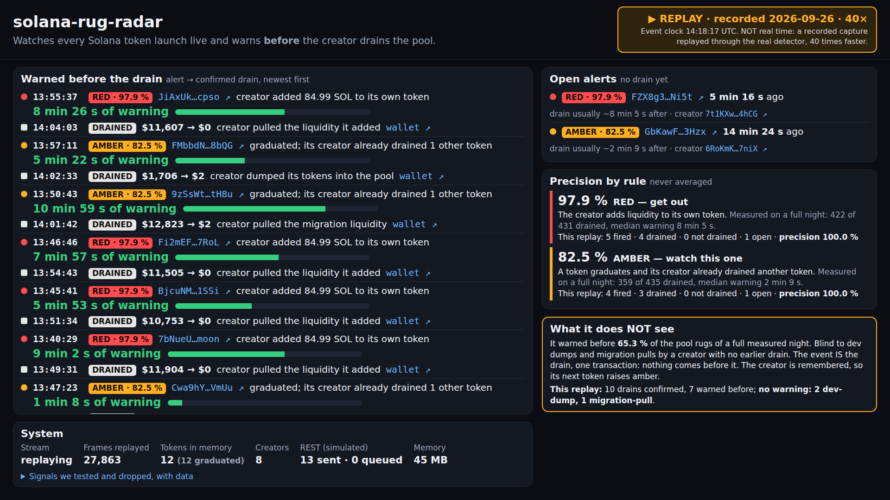

# solana-rug-radar

Real-time detection of **serial rug-pull operators** on Solana, built on
[Solami](https://solami.dev)'s Blur data stream.
Solami sidetrack, Colosseum Crypto World's Fair hackathon.

> **Status: complete (5 of 5 phases).** One command (`docker compose up --build`) starts the
> radar and its dashboard at <http://localhost:8080/>. With a Solami key it watches the live
> stream; without one it replays a real recorded hour through the same detector, labelled as a
> replay. Red/amber alerts, confirmed drains and the lead between them, each rule's own measured
> precision, and what the detector cannot see.



## The problem

Some operators don't rug one token: they rug **dozens a day, automatically**. On mainnet we
found one creator launching **48 tokens in 12 hours** and another **96 in under 9 hours**
(legitimate control creators: 1 each). Their tokens pump to $200k–350k market cap, then
liquidity collapses to $1–5 while 150–800 holders are left holding the bag.

Watching a full night of the stream showed a bigger, faster operation too: a fresh wallet per
token, its own pool with exactly 84.99 SOL, pulled ~8 minutes later, 40–47 times an hour. The
detector below is built on what the data showed, including the parts of our first hypotheses
that did **not** hold.

Per-token risk endpoints (including Solami's own `security`, `risk-intel`, `dev-history`) are
**snapshots**. Each launch looks unremarkable on its own. The pattern only appears
**across tokens and over time**.

**Our angle: temporal correlation.** Listen live, remember, and link tokens by creator.
Their endpoints are the photos; we make the movie.

### What the detector does

The rules come from a calibration on a real night of the stream (2026-09-26, 10.3 h, 19,447
launches, 16.6 M swaps; [`docs/ANALISIS_calibracion.md`](docs/ANALISIS_calibracion.md)), **not**
from the hypotheses we started with. Each alert level carries **its own** measured precision:
someone receiving an alert must know how far to trust *that* alert, not an average of two rules.

| Level | Rule | Precision (measured) | Lead before the drain |
|---|---|---|---|
| 🔴 **Red** — "get out" | The creator **adds liquidity to its own token** (`liquidity` add, provider = creator). No threshold: it is a fact of the event. | **97.9 %** (422 / 431, 431 different wallets) | p5 189 s · **p10 322 s** · p50 485 s · p90 597 s |
| 🟠 **Amber** — "watch this one" | A token **graduates** and its creator **already drained another token** earlier. | **82.5 %** (359 / 435) | p10 36 s · p50 129 s · p90 1,132 s |

Together they flag 866 tokens, of which 781 were drained (90.2 %), covering **65.3 %** of the
1,196 pool rugs of the night. That combined number describes the detector; it is never shown on
an alert.

What the red case looks like: a fresh wallet launches on meteora_dbc (it graduates in the same
second), opens its own pumpswap pool with **84.99 SOL**, waits ~8 minutes for buyers and pulls
everything. 40–47 of these an hour, all night, one wallet per token. The 84.99 SOL amount (420
of 422 cases) travels in the alert as a **confirmation fingerprint**, not as a rule: it marks the
same set as the red rule, and an operator could change it with one digit.

**Confirmed rug** (not an alert): a graduated token whose *tradable* liquidity reached **$1,000**
and then fell to **≤ $5** (`detection.liquidityCollapse`). It closes the alerts on that token (with
the lead time), is how precision is measured live, and is what the amber rule remembers. Its
mechanism is recorded: `creator-pull`, `migration-pull`, `dev-dump`, `sell-off`,
`third-party-remove`.

**Tradable liquidity** excludes the launchpad's own curve pools once a token graduates:
meteora_dbc leaves ~11–14 SOL in its curve pool that nobody can trade against. Counting it made
486 drained tokens look alive, including the pattern that started this project.

### What it does NOT see (limitation)

**35 % of pool rugs get no warning.** They are **dev dumps** (the creator sells into the pool: 462
that night) and **migration pulls** (the creator removes the liquidity it received when the
token migrated: 268), by creators with no earlier drain. In both, **the event is the drain**: one
transaction, in the same second. The detector confirms them instantly and remembers the creator
(its next token raises amber), but it cannot warn before the first one.

### Signals we dropped, and why

| Signal | Why it fell |
|---|---|
| > 10 launches in 24 h (alone) | 1.0 % precision: 216 of the 230 serial creators almost never graduate a token (spam, not rugs). Kept only to prioritize REST requests |
| Sell share (few sells before the drain) | It was the red signal seen from another angle; with the corrected liquidity metric it **inverts** (AUC 0.67 the wrong way) |
| Repeated final liquidity (1297.98, 1297.64…) | Drained pools end at ~$0: nothing left to repeat. The "repeated" values were the SOL stranded in the curve pool |
| Name reuse across creators | 52 % of drained tokens vs 50 % of the rest |
| `bundlers_count` (REST) | 0–2 in both groups |
| Graduation speed | Legitimate tokens also graduate in 0 s |
| Solami's `liquidity_usd` as the collapse source | After a liquidity `remove` it keeps showing ~2× the pre-drain pool for hours (1 in 6 red cases) |

All thresholds live in [`config/config.json`](config/config.json), never in the code. The red
rule has none.

## Architecture

```
                 Solami Blur (WebSocket firehose)            Solami Data REST (1 req/s)
                              │                                        │
                              ▼                                        ▼
  phase 2 ✅ ┌─────────────────────────────┐        ┌──────────────────────────────────┐
            │ EventSource: live WS │ replay│        │ SolamiRestClient        phase 1 ✅│
            │  backfill, reconnect+backoff│        │  TokenBucket 1 req/s, bounded    │
            │  dedup · priority backpress.│        │  3-tier cache: identity ∞ ·      │
            │  raw JSONL · /health        │        │                                  │
            └─────────────┬───────────────┘        │                                  │
                          ▼                        │  security 10 min · history 60 s  │
  phase 1 ✅ ┌─────────────────────────────┐        │  (history cached BY CREATOR)     │
            │ normalization border        │        │  never asks a mint < 10 s old    │
            │  lossless JSON (bigint)     │        └────────────────┬─────────────────┘
            │  decimal strings → Decimal  │                         │
            │  seconds/millis → branded   │                         │
            │  api_key redaction          │                         │
            └─────────────┬───────────────┘                         │
                          ▼                                         │
  phase 3 ✅ ┌─────────────────────────────┐  dev-history, by        │
            │ StateStore (event time)     │  priority (Enricher) ◄──┘
            │  token: stage, pools,       │  suspect > graduation >
            │   liquidity readings, peak  │  new creator > known
            │  creator: launches + outcome│
            │  order-independent, bounded │
            │  warm start from raw log    │
            └─────────────┬───────────────┘
                          ▼  store listener (after each applied event)
  phase 4 ✅ ┌─────────────────────────────┐
            │ Detector (stream only)      │──► alerts + confirmed rugs: console, /health,
            │  red · amber · rug confirm  │    data/alerts/detector-YYYYMMDD.jsonl (live),
            │  tradable liquidity         │    re-read at startup
            └─────────────┬───────────────┘
  phase 5 ✅               ▼  same process, same node:http server as /health
            ┌─────────────────────────────┐
            │ Dashboard  GET /            │  one HTML page, no framework, polls every 1 s
            │            GET /api/dashboard│  view model built (and tested) in src/dashboard/
            └─────────────────────────────┘
```

### Design decisions

- **One normalization border.** Solami sends decimals as JSON strings and raw amounts as JSON
  numbers that can exceed 2^53. Both fail silently in JavaScript (`"1.5"+"0.5"` is
  `"1.50.5"`; `11196105564446459` parses as `…460`). Every frame goes through
  [zod](https://zod.dev) schemas that turn decimals into `Decimal`, amounts into `bigint`, and
  reject anything unexpected. Nothing numeric leaves the border as a string.
- **Timestamps carry their unit in the type.** `UnixSeconds` and `UnixMillis` are opaque types:
  the compiler rejects adding, subtracting or comparing one with the other.
- **Typed against real captures, not docs.** All 12 stream event types were checked against
  254k real frames; list snapshots have no sample yet and are quarantined as `unverified`.
- **Designed for the free plan.** One request per second, no burst, a bounded queue, and caches
  shaped by how the data changes: `dev-history` is keyed by creator, so one operator's 48 tokens
  cost one request.
- **Bounded memory.** ~40,000 tokens are launched per day (measured over a 10.5 h live
  capture), and the full stream carries ~970 events/s (swaps and transfers are chain-wide).
  Every cache, queue and state map has a size limit.
- **One interface, two origins.** Live WebSocket and on-disk replay deliver events through the
  same `EventSource` interface and the same pipeline, so later phases cannot tell them apart:
  development and tests run without network, and replay is the fallback if stream access shrinks.
- **Deduplication key chosen from data.** `signature + ix_index + inner_ix_index` is *not*
  unique: one swap instruction emits two events, one per side of the pair (5,868 collisions in
  our captures). Adding the mint makes it unique across 181k real events.
- **Backpressure drops by priority, it never "stops reading".** A firehose cannot be paused:
  the server would disconnect us and the reconnect backfill only recovers ~0.5 s of swaps. The
  bounded queue drops swaps/transfers first and token launches last, and counts every drop.
- **Memory on event time, independent of arrival order.** The state's clock is the newest
  event time seen (the watermark), so a 10-hour replay behaves like 10 hours live. Stages only
  move forward, "time of" facts keep the earliest value, superseding readings compare on-chain
  positions (slot, tx, instruction), launches are keyed by mint. Tests replay the same events
  in shuffled orders and twice, and require an identical state.
- **Tokens are forgotten, creators are not.** A token idle for 60 min on the curve (24 h once
  graduated) is folded into a compact record on its creator and dropped. Creators are kept for
  the whole 24 h window, and for 7 days once they crossed the launch-burst threshold.
- **Liquidity includes swaps.** A pool drained by selling never emits a liquidity `remove`, so
  reserves are also read from swaps of followed tokens (one reading per pool per minute).
- **REST budget by priority.** dev-history is one request per creator: suspects (re-polled
  every 10 min) > graduations > first launch of an unknown creator > known creators. A mint is
  never asked about before it is 10 s old: Solami answers 404 "no creation record" until it has
  indexed it (51 of 105 live asks at 0–2 s; all 51 answered at 5–8 s). Known issue, left on
  purpose: re-polling serial creators takes ~2/3 of the budget.
- **Restart without amnesia.** On a live start the last 24 h of the persisted raw lifecycle log
  are replayed into the state (the raw log *is* the persistence: no second format).
- **The detector needs no REST.** Both alert rules and the rug confirmation use the stream
  only: it works with a stream key and nothing else.
- **Alerts are records, not log lines.** Level, rule, mint, creator, block time, receive time,
  origin (realtime or reconnect backfill), the triggering event's on-chain position, evidence
  (amount, pool, fingerprint, prior rugs) and the rule's measured precision. One alert per level
  per token, ever (also across restarts).
- **An evidence log with memory.** Live, every alert and confirmed rug is appended to
  `data/alerts/`; the last 7 days are re-read at startup. It is what the demo shows ("red at
  03:14:22 → drained at 03:22:47, 505 s later, creator-pull"), how precision is measured live,
  and how the amber rule survives a restart (the warm start replays only lifecycle events, where
  dev dumps are invisible).
- **Validated end to end.** The whole night capture through the real detector reproduces the
  calibration: red 431 / 422 and the same lead percentiles to the second; amber 436 / 360
  (analysis 435 / 359). The small rug-count difference (1,214 vs 1,196) is explained case by case
  in `docs/RESUMEN_Fase_4.md`.
- **Least privilege.** The API key only needs the *Data API* role.

## Run it

Requirements: Docker. For local development, Node.js 24+.

```bash
docker compose up --build
```

- **With an API key** (`SOLAMI_API_KEY` in `.env`): rebuilds its memory from the last 24 h
  saved in `./data/live/` (if any), connects to the live Blur stream, starts from the backfill
  and switches to realtime, enriching creators through the REST API at 1 req/s. The raw stream
  is saved to `./data/live/`.
- **Without a key:** replays the bundled demo capture (`samples/demo-20260926.jsonl.gz`, below)
  through the same pipeline, state and detector (REST budget simulated), 40× faster than real
  time, and then keeps showing the final state. A jury needs nothing else.

Then open **<http://localhost:8080/>**.

### The dashboard

One page, served by the same process (no framework, no build step, no second container). What
it shows, in order of importance:

1. **Warned before the drain** — the sequence the project exists for: the alert (red or amber,
   with its rule's own measured precision on its tag), **how long before** the drain it came, and
   the drain (time, $ before → after, what happened, the wallet that did it). Tokens and wallets
   link to Solscan, so anyone can check.
2. **Open alerts** — no drain yet, with their age and when the drain usually comes for that rule;
   and alerts that got **no** drain within 60 min ("counts against precision").
3. **Precision by rule**, never averaged: measured on the calibration night, and so far here.
4. **What it does NOT see** — the 65.3 % coverage, the kind of rug it is blind to, and the drains
   that got no warning, counted as they happen.
5. **System** — stream state, events/s, tokens and creators in memory, REST budget, memory; and
   the signals we tested and dropped, with the reason.

Times are **event time** (block time). The badge in the corner says which of these it is, and
they never look alike:

| Badge | Meaning |
|---|---|
| 🟢 `LIVE · 02:12:32 UTC` | Connected to the live stream. Each alert shows how many seconds after its block we raised it (1–2 s in real time; more, and labelled, when it came from the backfill sent on connecting: its lead is measured from the block, so the real warning was that much shorter). |
| `STARTING · not live yet` | Rebuilding memory from the last 24 h of saved stream before connecting (~2 min). |
| `LIVE STREAM NOT CONNECTED` | Reconnecting; what is on screen is not current. |
| `REPLAY · recorded 2026-09-26 · 40×` | A recording through the real detector, 40 times faster. The clock is the recording's. |
| `REPLAY FINISHED` | Final state, frozen; nothing is arriving (no events/s). |
| `DISCONNECTED` | The page cannot reach the process. |



**The demo capture.** Every raw frame (34,744, key-free, 7.3 MB gzip) of 17 tokens from the
2026-09-26 night, 13:28–15:10 UTC, built by `src/calibration/demo.ts`. It shows the limits, not
only the hits: 10 red alerts drained 86 s to 9 min later; creators whose **first** drain (a dev
dump, a migration pull) nobody could see coming, followed by an amber on their next token; and an
amber that was **not** drained. It plays in ~2.5 min at 40× (`REPLAY_SPEED`, 0 = as fast as
possible). A CI test replays it and requires the phase-4 validation's records for those tokens,
the same at 1× and 20×. Left out: the night's red alerts that never drained. They are healthy,
busy tokens (the three measured: 22–31k swaps over hours; that is why they did not drain), too
big to bundle.

Alerts and confirmed rugs print as they happen:

```
[ALERT RED] 2026-09-26 06:43:59 3QmL6N…PQPB5 — creator added 84.99 SOL [85-SOL fingerprint] — precision 97.9% (422/431) https://solscan.io/token/…
[RUG] 2026-09-26 06:49:48 3QmL6N…PQPB5 — creator-pull by GQjpaT37… ($10229.71 → $0.00) — confirms red alert 349 s earlier https://solscan.io/token/…
```

Live, each one is also appended as a JSON record to `data/alerts/detector-YYYYMMDD.jsonl` (a
replay never writes there).

Health: <http://localhost:8080/health> (JSON; 200 healthy, 503 not) and summary lines in the logs
every 30 s. `state` shows what the memory knows (tokens by stage, creators, REST requests sent /
discarded, heap); `state.detector` shows alerts per level (fired, confirmed, unconfirmed after
60 min, open, **live precision**, median lead) and confirmed rugs by mechanism. Memory after a
full night: ~80 MB for the state and detector, plus the REST caches (~90 MB, bounded). Stop with
Ctrl+C: it closes the socket, flushes pending disk writes and exits.

### Disk usage

The full raw stream is ~58 GB/day, so persistence is capped. **Defaults are conservative on
purpose:** 1 GB for lifecycle events (launches, graduations, liquidity, meme…) and 500 MB for
swap/transfer; the oldest files are deleted first. To keep more, add to `.env`:

```bash
PERSIST_LIFECYCLE_MAX_MB=10240   # 10 GB ≈ 4 days of lifecycle events
PERSIST_FIREHOSE_MAX_MB=5120     # 5 GB ≈ 2 hours of swaps + transfers
```

Other options: `INGEST_SOURCE=live|replay` forces the origin; `REPLAY_PATHS=a.jsonl,dir/` picks
what to replay (`.jsonl` and `.jsonl.gz`; default `samples`); `REPLAY_SPEED` sets its pace. Everything else (types, backfill, reconnect backoff, queue size) is in
`config/config.json`.

Local development:

```bash
npm ci
npm run lint            # eslint + typecheck (includes compile-time type tests)
npm test                # vitest
npm run test:coverage
npm run build && npm start   # ingestion (live with a key, replay without)
npm run replay               # check ./data captures against the normalization border
npm run analyze              # replay ./data/live through the state (reads files in name order: see below)
node --expose-gc dist/calibration/validate.js 20260926   # the whole night through the detector vs the calibration
```

`src/calibration/` replays a capture with both tiers interleaved by `block_time`; replaying
`data/live/` file by file puts hours of swaps before or after their tokens.

Copy `.env.example` to `.env` and set `SOLAMI_API_KEY` (a key with only the Data API role).
**Never commit raw captures:** Solami embeds the API key in metadata `image_url`s.

## Layout

```
config/config.json      thresholds, rate limit, cache TTLs (validated at startup)
src/core/               time.ts (branded time) · json.ts (lossless parse) · schema.ts (field validators)
src/events/             types.ts (normalized events) · schemas.ts (raw→normalized) · normalize.ts
src/rest/               client.ts · token-bucket.ts · ttl-lru-cache.ts
src/ingest/             source.ts (EventSource + FrameProcessor) · live-source.ts · replay-source.ts
                        dedup.ts · event-queue.ts · backoff.ts · raw-persister.ts · health.ts
src/state/              store.ts (StateStore) · token-state.ts · creator-state.ts · pending.ts · order.ts
                        quote-prices.ts · scheduler.ts + enricher.ts (REST policy) · warm-start.ts · factory.ts
src/detector/           detector.ts (red, amber, rug confirmation) · types.ts (records) · registry.ts (JSONL) · factory.ts
src/dashboard/          view.ts (what the page shows, tested) · feed.ts (recent records) · page.ts (the HTML page)
src/calibration/        offline calibration and validation on a capture (capture.ts, extract.ts, report.ts, validate.ts…)
src/config.ts           config loader
src/main.ts             entrypoint: ingestion + state + detector + dashboard
src/replay.ts           offline check of captures
src/analyze.ts          offline replay through the state (calibration material for phase 4)
samples/                demo-20260926.jsonl.gz: the demo capture (real frames, no key)
tests/                  vitest suites + tests/fixtures (redacted real frames)
docs/dashboard-*.png    the dashboard, live and in replay
docs/RESUMEN_Fase_*.md  design rationale per phase, decision by decision (Spanish)
```
